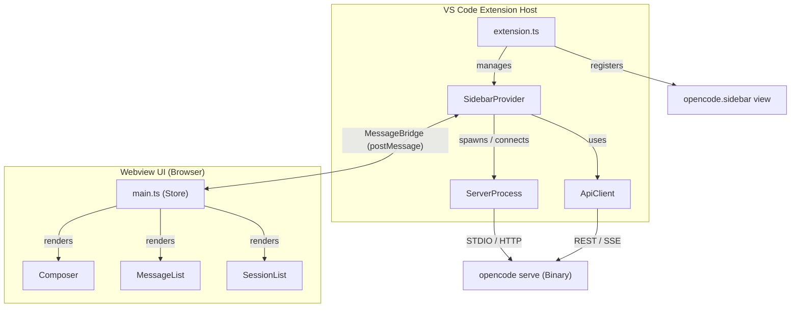

# OpenCode Sidebar for VS Code

A VS Code extension that integrates [OpenCode](https://opencode.ai) directly into your editor as a sidebar chat interface. Manage sessions, switch AI models, configure provider API keys, and interact with AI assistants without leaving your IDE.

## Features

- **Chat sidebar** — Persistent AI chat panel accessible from the VS Code activity bar
- **Multi-session management** — Create, rename, switch between, and delete conversations
- **Multi-model support** — Switch between providers (Anthropic, OpenAI, Google AI, Groq, Mistral, xAI, DeepSeek, Cohere) from a dropdown in the composer
- **Provider key management** — Add/remove API keys for each provider directly from the sidebar header
- **Streaming responses** — Real-time message streaming with Markdown rendering and syntax highlighting
- **Tool call display** — See AI tool invocations and results inline in the conversation
- **Permission prompts** — Approve or deny agent operations requiring user confirmation
- **Context usage tracking** — Progress bar showing token usage relative to the model's context window
- **Auto server management** — Spawns an OpenCode server automatically, or attaches to an existing one

## Installation (VS Code Marketplace)

Search for **OpenCode Sidebar** in the VS Code Extensions view (`Ctrl+Shift+X`), or install from the terminal:

```bash
code --install-extension wisdowl.opencode-sidebar
```

Alternatively, install from a `.vsix` package (see [Build from Source](#build-from-source) below).

## Requirements

- VS Code 1.118.0 or later
- [OpenCode](https://opencode.ai) binary installed and accessible in your `PATH`

To install the OpenCode binary, follow the [official OpenCode installation guide](https://opencode.ai).

## Extension Settings

| Setting | Default | Description |
|---|---|---|
| `opencode.binaryPath` | `"opencode"` | Path to the `opencode` binary |
| `opencode.serverArgs` | `[]` | Extra arguments passed to `opencode serve` |
| `opencode.defaultModel` | `""` | Default model in `provider/model` format (e.g. `anthropic/claude-sonnet-4-6`) |
| `opencode.serverUrl` | `""` | Connect to an already-running OpenCode server instead of spawning one |

## Build from Source

### Prerequisites

- Node.js 18 or later
- npm
- Git

### Steps

```bash
# Clone the repository
git clone https://github.com/arielgoes/opencode-sidebar.git
cd opencode-sidebar

# Install dependencies
npm install

# Compile the extension
npm run compile

# Package as a .vsix file
npm run package
```

This produces a `opencode-sidebar-<version>.vsix` file in the project root.

### Install the `.vsix` into VS Code

1. Open VS Code
2. Go to the Extensions view (`Ctrl+Shift+X` / `Cmd+Shift+X`)
3. Click the `...` menu (top-right of the Extensions panel) → **Install from VSIX...**
4. Select the generated `.vsix` file

Or install from the terminal:

```bash
code --install-extension opencode-sidebar-<version>.vsix
```

### Development workflow

```bash
# Watch mode — rebuilds on every file change
npm run watch

# Run unit tests
npm run test:unit

# Run full extension tests (launches a VS Code Extension Host)
npm run test

# Lint and type check
npm run lint
npm run check-types
```

To run and debug the extension during development:

1. Open the repository in VS Code
2. Press `F5` to launch the **Extension Development Host**
3. The OpenCode sidebar will be available in the new window's activity bar

## Publishing to the Marketplace

### First-time setup

Make sure you are on Node.js 24 (the version in `.nvmrc`):

```bash
nvm use
```

### Releasing an update

1. **Bump the version** in `package.json` (follows [semver](https://semver.org)):
   ```json
   "version": "0.1.0"
   ```

2. **Build the `.vsix`:**
   ```bash
   npx @vscode/vsce package
   ```
   This runs the full build (`check-types`, `lint`, `esbuild --production`) and produces `opencode-sidebar-<version>.vsix` in the project root.

3. **Upload to the marketplace** — two options:

   **Option A — Manual upload (no PAT needed):**
   - Go to [marketplace.visualstudio.com/manage/publishers/wisdowl](https://marketplace.visualstudio.com/manage/publishers/wisdowl)
   - Click the `...` menu next to the extension → **Update**
   - Select the new `.vsix` file → **Upload**

   **Option B — CLI publish (requires a PAT):**
   - Create a Personal Access Token at [dev.azure.com](https://dev.azure.com): User settings → Personal access tokens → New Token → Organization: *All accessible organizations* → Scopes: *Marketplace → Manage*
   - Then run:
     ```bash
     npx @vscode/vsce publish --pat YOUR_PAT_HERE
     ```

4. **Commit and push** the version bump:
   ```bash
   git add package.json
   git commit -m "chore: bump version to 0.1.0"
   git push
   ```

## Architecture Overview



| Layer | Location | Description |
|---|---|---|
| Extension host | `src/extension.ts`, `src/sidebar/`, `src/opencode/` | Registers the webview, manages the OpenCode server process, and bridges messages |
| Webview UI | `src/webview/` | Vanilla-JS component tree with a Redux-style store; renders sessions, messages, and the composer |
| OpenCode client | `src/opencode/apiClient.ts`, `src/opencode/sseClient.ts` | Wraps the `@opencode-ai/sdk`; handles REST calls and SSE streaming |

Communication between the extension host and webview uses VS Code's `postMessage` API. Real-time updates from the OpenCode server arrive via Server-Sent Events.
